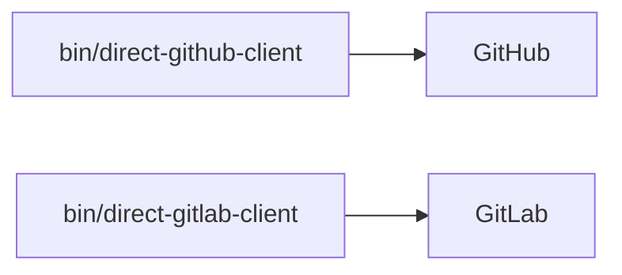
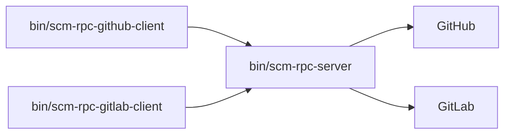
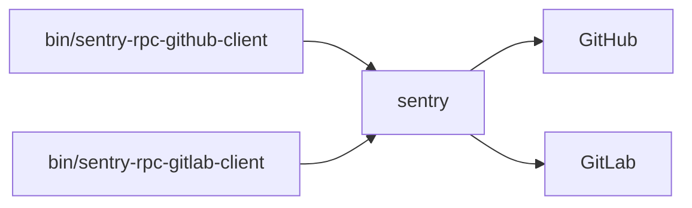

## Introduction

The SCM (Source Code Management) platform is a vendor-agnostic abstraction layer for interacting with source code management service-providers such as GitHub, GitLab, and Bitbucket. It decouples Sentry's product features from service-provider-specific APIs by presenting a single, declarative interface for both reading and writing SCM resources and for reacting to SCM webhook events.

### Goals

1. **Service-provider independence.** Product code should never import a service-provider's client or parse a service-provider's response format directly. All interactions should flow through a common interface. Adding new service-providers should not require changes to existing implementations.
2. **Declarative usage.** Callers should describe _what_ they want (e.g. "create a pull request") not _how_ to accomplish it. Initialization, authentication, rate limiting, and response mapping are handled internally.
3. **Fair access.** All use cases should be given fair access to a service-provider without any one implementation starving the rest. Referrer-based quota allocation policies prevents any single use case from exhausting the service-provider's API quota.
4. **Centrally enforced access controls.** Access controls must be strictly and consistently enforced across all SCM service-providers to prevent unprivileged access to sensitive customer data. The security model should be implemented once and applied universally.
5. **Observable.** Every outbound action and every inbound webhook listener automatically records success/failure metrics, emits traces, and reports errors and logs to Sentry. The health of the SCM platform should always be knowable.
6. **Extensible.** The SCM platform should be maximally and trivially extensible. As core infrastructure it should mutate as business needs change and not ossify a particular implementation.

### Features

The platform exposes three subsystems:

- **Actions** — outbound SCM operations initiated by Sentry code. The `SourceCodeManager` class provides 70+ methods covering comments, reactions, pull requests, branches, git objects, reviews, and check runs. With more actions planned to be added as we port more use cases.
- **Actions RPC** - outbound SCM commands exposed over the network. The `SourceCodeManager` is fully available over the network. This enables usage of the SCM for services outside the monolith.
- **Event Stream** — inbound webhook processing. SCM service-providers push events which are deserialized into typed, provider-neutral dataclasses (`CheckRunEvent`, `CommentEvent`, `PullRequestEvent`) which are then dispatched to registered listener functions.

### Why

Ad-hoc usage of a SCM service-provider's API client tightly couples your application code to that provider. Ad-hoc management of access controls increases Sentry's security vulnerability surface area (specifically IDOR vulnerabilities). And ad hoc use of API clients can lead to resource exhaustion, starving critical product features of quota without consideration.

You should not need to care about any of these things. These problems should be solved once and managed for you. It should be impossible for you to perform an action which violates a security boundary. It should be impossible for your usage of the SCM to break another feature's SLO. The less you have to think about, the more you can focus on solving the business case.

The SCM solves all the problems you don't want to care about.

### Getting Started

We have extensive documentation both inline in the Sentry codebase and on the [Sentry developer documentation](https://develop.sentry.dev/backend/source-code-management-platform/) portal. If you're interested in expanding your SCM usage or in enabling new service-providers for a limited amount of effort take a took at the SCM platform.

### Interactive testing

We provide a few command-line scripts for interactive testing.

You'll need to create `.credentials` according to `.credentials.template` before using them.

All `bin/*-client` have the same subcommands (see [`add_commands`](src/scm/private/cli_support.py) or use the `--help` command-line option). Some subcommands will fail if attempted against a provider that doesn't implement them.

Rationale for having `bin/*-github-client` and `bin/*-gitlab-client`: it lets you configure your favorite test repository in `.credentials` for each provider.

Rationale for having three different kinds of clients: it lets you use the following three modes to target the SCM hosts.

#### Targetting SCM hosts directly



Example: `bin/direct-github-client get-repository | jq .data` produces something like:

```
DEBUG:urllib3.connectionpool:Starting new HTTPS connection (1): api.github.com:443
DEBUG:urllib3.connectionpool:https://api.github.com:443 "POST /app/installations/120833184/access_tokens HTTP/1.1" 201 323
DEBUG:urllib3.connectionpool:Starting new HTTPS connection (1): api.github.com:443
DEBUG:urllib3.connectionpool:https://api.github.com:443 "GET /repos/jacquev6/test-Sentry-Integration-Dev-jacquev6 HTTP/1.1" 200 None
{
  "full_name": "jacquev6/test-Sentry-Integration-Dev-jacquev6",
  "default_branch": "main",
  "clone_url": "https://github.com/jacquev6/test-Sentry-Integration-Dev-jacquev6.git",
  "private": false,
  "size": 1
}
```

#### Using the RCP, going through `bin/scm-rpc-server`:



Example: run `bin/scm-rpc-server` in a terminal, then `bin/scm-rpc-gitlab-client get-app-installation | jq .data` in another to produce something like:

```
DEBUG:urllib3.connectionpool:Starting new HTTP connection (1): localhost:8080
DEBUG:urllib3.connectionpool:http://localhost:8080 "GET /api/0/internal/scm-rpc/ HTTP/1.1" 200 None
DEBUG:urllib3.connectionpool:Starting new HTTP connection (1): localhost:8080
DEBUG:urllib3.connectionpool:http://localhost:8080 "POST /api/0/internal/scm-rpc/ HTTP/1.1" 200 None
{
  "has_read_access": true,
  "has_write_access": true
}
```

#### Using the RPC, going through a Sentry development environment:



Example: with your sentry development environment running in a terminal (and the target repository configured via Sentry's "integrations" GUI), run `bin/sentry-rpc-github-client get-pull-request 2 | jq .data` from another terminal to produce something like:

```
DEBUG:urllib3.connectionpool:Starting new HTTP connection (1): localhost:8000
DEBUG:urllib3.connectionpool:http://localhost:8000 "GET /api/0/internal/scm-rpc/ HTTP/1.1" 200 217
DEBUG:urllib3.connectionpool:Starting new HTTP connection (1): localhost:8000
DEBUG:urllib3.connectionpool:http://localhost:8000 "POST /api/0/internal/scm-rpc/ HTTP/1.1" 200 None
{
  "internal_id": "3329785233",
  "id": "2",
  "title": "Add blah",
  "body": null,
  "state": "open",
  "merged": false,
  "html_url": "https://github.com/jacquev6/test-Sentry-Integration-Dev-jacquev6/pull/2",
  "head": {
    "sha": "7497e018d01503b6abc3053b7896266115e631f6",
    "ref": "topics/blah"
  },
  "base": {
    "sha": "0941ee0a9eac9914cfddf5adec7a9558a2f1c447",
    "ref": "main"
  },
  "author": {
    "id": "327146",
    "username": "jacquev6"
  }
}
```

# Releasing a New Version

1. On the `getsentry/scm-platform` repository page click the `Actions` tab.
2. On the left hand side click the "release" item.
3. Click "Run Workflow" and enter a version number.
4. The workflow will run. After completion it will return a url to an issue on getsentry/publish.
5. On the getsentry/pulish immediately set the "accepted" label.
6. A pull request will opened on getsentry/pypi.
7. Edit the file in GitHub and place `python>=3.13` on the line immediately following the changed line.
8. The PR will merge automatically. When its merged your feature is available for use.